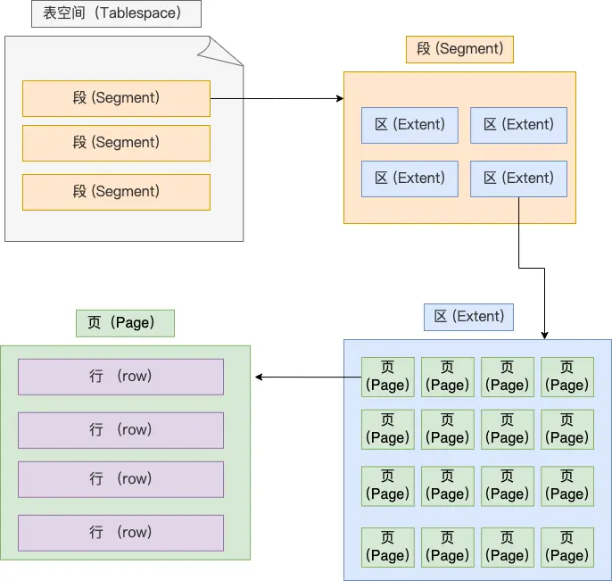
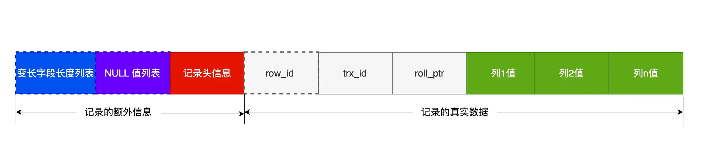

1. 表空间由 段、区、页、行，逻辑包含关系
    * 
   1. 行指数据行，数据都是按行存储的
   2. 页，innodb 读取的单位是页，默认大小是16K，页的类型有很多，常见的有数据页、undo页、溢出页等，数据表中的行使用数据页管理的
   3. 在表中数据量大的时候，为某个索引分配空间的时候不再按页来分配，按照区来分区，每个区的大小默认是1M，可以分成64个页，而且这64个页是连续的，那么在进行范围查找的时候，就可以变成顺序读写，提高IO效率
   4. 表空间是由各个段组成的，段是由多个区组成的。段一般分为数据段、索引段和回滚段
      5. 索引段：存放B+树非叶子节点的区的集合
      6. 数据段：存放叶子节点的区的集合
      7. 回滚段：存放的是回滚数据的区的集合
2. 行格式
   *   
   1. 变长字段长度列表
      2. 主要记录变长字段的长度，变长字段主要是varchar(n) n是字符数，不同的字符集一个字符占用的字节数不同
      3. 如果表不存在变长字段，该数据不存在
      4. 记录的字段的长度，逆序存放，主要是为了利用cahce line ，读取的时候可以最大限度的读到真实数据的前面的列与长度关系
      5. mysql规定除blob与text，一行的总长度为65535字节，包含变长字段长度列表与Null值列表
      6. 行溢出，一个16K的页，最多存储16384字节，如果数据量比较大，一页都可能放不下一条数据，此时就发生溢出，溢出的数据会存放到溢出页中，在真实数据记录中，会存一个20字节的指针来指向溢出页
   2. NULL值列表
      3. 记录表中可为null的字段，使用二进制位记录，最小记录单位是1个字节，0代表不为null，1代表null
      4. 也是逆序记录
      5. 如果字段值为null，在真实数据中是不会存在的
   3. 记录头信息
      4. delete_mask 标识是否删除
      5. next_record 下一条记录的位置
      6. record_type 表示当前记录的类型，0 表示普通记录，1 表示B+树非叶子节点记录，2表示最小记录，3表示最大记录
   4. 
   