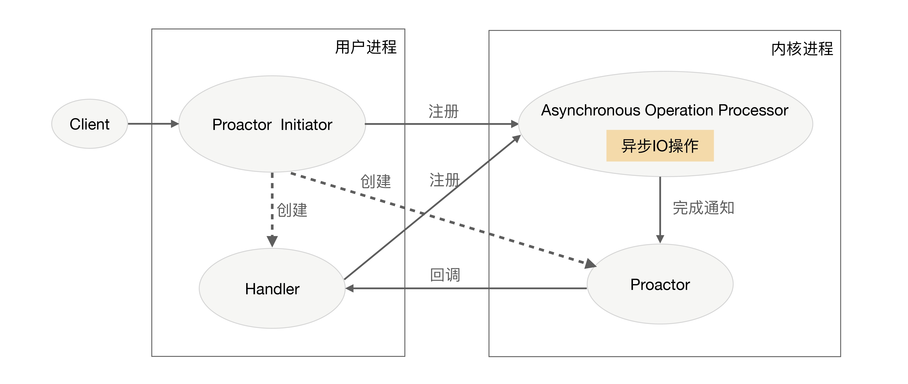

1. 单服务器高性能的关键之一就是服务器采取的并发模型
    * I/O 模型:阻塞、非阻塞、同步、异步
    * 进程模型：单进程、多进程、多线程
2. PPC 是 process per connection,每次有一个新的连接就建一个新的进程去处理这个连接请求，这就是传统的Unix网络服务器所采用的模型。
    * PPC 模式中当连接进来时才创建新的进程处理连接请求，由于fork进程代价太高，用户访问时可能感觉比较慢
    * prefork 在系统启动时先创建好进程，然后再开始接收用户请求，当有新连接进来的时候就不需要fork进程了
    * 主要存在的问题
        - fork进程代价太高
        - 父子进程间通信复杂
        - 支持并发连接数量有限
3. TPC 是 Thread per connection，每次有新的连接就建一个新的线程处理这个连接请求。与进程相比，线程更轻量级，创建线程所需要的资源也少，线程间是共享进程的内存空间，线程间的通信也更轻量
    * 缺点
        - 创建代价相对进程低，但是在高并发是还会有性能问题
        - 引入线程间互斥跟共享的复杂度
        - 多线程可能会互相影响，一个线程出现问题可能会导致整个系统退出，eg：内存越界
    * prethread，预先创建线程
4. Reactor
    * I/O多路复用技术
        - 当多条链接公用一个阻塞对象后，进程只需要在一个阻塞对象上等待，而无需轮询所有链接，常见的实现方式 select,epoll,kqueue
        - 当某条连接有新的数据可以处理时，操作系统会通知进程，进程从阻塞状态返回，开始进行业务处理。
    * Reactor 模式的核心组成不封包括Reactor和处理资源池（进程池或线程池），其中Reactor负责监听和分配事件，处理资源池处理事件。
    * 非阻塞网络同步模型，因为真正的read跟send都是用户进程在操作，这里的同步指用户进程在执行read和send这类I/O操作的时候是同步的。
    * 典型如netty，java nio
5. PReactor（AIO）
    * 如果把I/O操作改成异步就能进一步提升性能，这就是异步网络模型Proactor
    * 
        