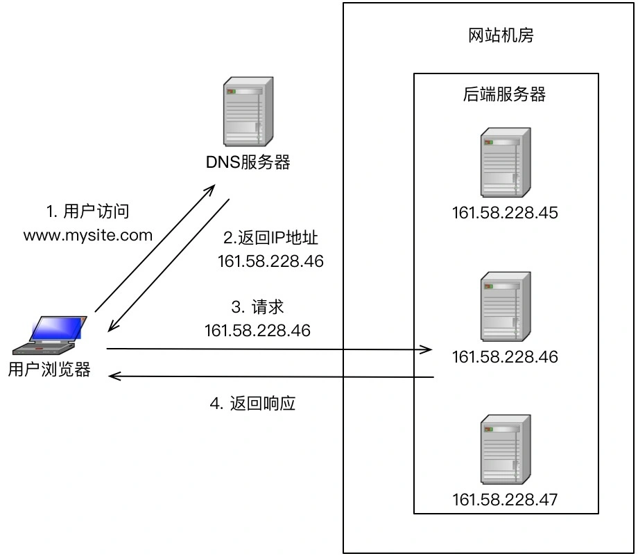

#### 分类及架构
1. 高性能集群的复杂性主要体现在需要增加一个任务分配器以及为任务选择一个合适的任务分配算法
2. 负载均衡分类
    1. DNS负载均衡
        * 根据访问者Ip，通过DNS服务器获取最近的服务器机房
        * 
    2. 硬件负载均衡
        * F5 或 A10
        * 功能强大：全面支持各层级的负载均衡，支持全面的负载均衡算法，支持全局负载均衡。
        * 性能强大：百万级别并发
        * 稳定性高：商用硬件，经过大规模验证
        * 支持安全防护
        * 价格贵
        * 扩展性差
    3. 软件负载均衡
        * 通过负载均衡软件来实现。常见的的有nginx（7层）和lvs（4层）
        * 软件的性能在万级别
3. 通常整三种架构是配合使用的

#### 算法
1. 任务平分类
    * 轮询
2. 负载均衡类
    * 加权轮询
        - 解决不同服务器处理能力差异的问题
    * 负载最低优先（需要负载均衡器感知、统计服务器的状态）
        * 最少连接数
        * CPU负载最低
3. 性能最优类
    * 优先将任务分配给处理速度的服务器
    * 需要统计每个请求的响应时间，全量统计资源消耗大，采样统计需要确认采样率以及采样的周期
4. Hash类
    * 根据任务中某些关键信息进行hash运算，将相同Hash值的请求分配大同一台服务器上，这样做的目的主要是为了满足特定的业务需求。
    * 主要是满足有状态的服务

