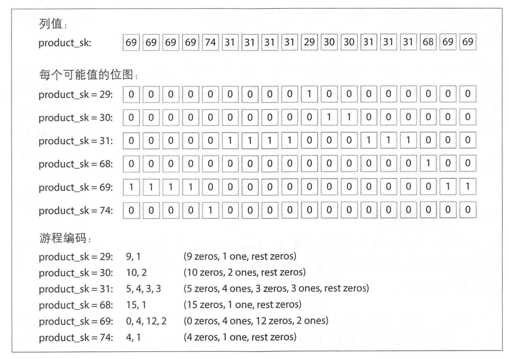

##### 数据密集型应用
1. 软件千变万化，终有若干理念贯穿其中，本书着重探讨不同的设计理念以及如何权衡。
2. 本书主要分成三部分
   1. 主要讨论有关增强数据密集型应用系统所需的若干基本原则
      1. 可靠性、可扩张性、可维护性
      2. 多种不同数据模型与查询语言，讨论各自的适用场景
      3. 存储引擎，数据库如何安排磁盘结构，从而提高检索效率
      4. 数据序列化，常见模式的演变过程
   2. 从单机数据库存储转向跨机器的分布式系统
      1. 数据远程复制
      2. 数据分区
      3. 事务
      4. 分布式环境如何达成共识与一致性
   3. 产生派生数据的系统，主要只数据异构
      1. 批处理
      2. 流处理
      3. 总结之前介绍的技术，探讨未来构建可靠、可扩展、可维护应用系统可能的新方向或方法
3. 数据系统基础
   1. 可靠、可扩展与可维护的应用系统
      1. 可靠性：当出现意外情况如硬件、软件故障、人为失误等，系统应可以正常运转：虽然性能可能有所降低，但确保功能正确。
      2. 可扩展性：随着规模的增长，例如数据量、流量或复杂性，系统应以合理的方式来匹配这种增长
         1. 描述负载：qps、IO、CPU、缓存命中率、数据库写入比例
         2. 描述性能：响应时间（服务）、吞吐量（数据系统）
      3. 可维护性：随着时间的推移，许多新的人员参与到系统开发和运维，以维护现有功能或适配新场景等，系统都应高效运转
         1. 可运维性：运维更轻松
            1. 良好的可操作性意味着是日常工作更加简单
               * 提供对系统运行时，行为和内部的可观测性，方便监控
               * 支持自动化，与标准工具集成
               * 避免绑定特定机器，允许机器停机维护，保证系统不间断运行
               * 提供良好的文档和易于理解的操作模式，eg：如果我做了X会发生Y
               * 提供良好的默认配置，且允许管理员在需要时方便的修改默认值
               * 尝试自我修复，在需要时让管理员手动控制系统状态
               * 行为可预测，减少意外发生
         2. 简单性，简化复杂度
            * 复杂性有各种各样的表现形式：状态空间的膨胀、模块紧耦合、令人纠结的相互依赖关系、不一致的命名和术语、为了性能而采取的特殊处理、未解决特定问题而引入的特殊处理框架
            * 消除意外复杂性最好的手段之一是抽象
         3. 可演化性，易于改变
   2. 数据模型与查询语言
      1. 关系型数据模型
      2. 文档型数据模型
      3. 图状数据模型
   3. 数据存储与检索
      1. 数据库核心；数据结构
         * 索引：适当的索引可以加快检索的速度，但每个索引都会减慢写速度
           * Hash索引
             * 所有key都放在内存中，value保存数据存储的位置偏移量，这样value可以存储远大于内存的数据
             * 追加日志，每次k-v的变化，都追加到日志中
             * 日志分段，避免磁盘用尽，日志文件到达一定大小后就分段，然后在这些段上就可以执行压缩，即只保留每个键最近一次更新
             * 段合并，段压缩以后会变小，多个段可以合并成一个段，写入新的文件中。每个段都有自己的HashMap，按段的时间倒序检查key，段的压缩与合并在后台进行，结束后将旧文件删除，使用新文件
             * 需要考虑的问题
               * 文件格式，使用二进制格式，首先以字节为单位来记录字符串的长度，之后跟上原始字符串
               * 删除记录，如果要删除k-v，则必须在日志文件中追加一个特殊记录（有事成为墓碑），当日志段合并时，当发现墓碑标记则会丢弃这个键的所有值
               * 崩溃恢复，读取段重新加载k-v，如果日志段太大可能会耗费太长时间，可以每隔一段时间做快照，通过快照来恢复
               * 部分写入的记录
               * 并发控制，写的时候是以严格的先后顺序写入，通常只用一个线程写入，数据文件段是追加的，并且是不可变的，所以他们可以被多个线程同时读取
             * 局限性
               * Hash表必须全部放入内存，如果有大量的键，存储在磁盘上，存在大量的io，hash变满，继续增长代价昂贵，hash冲突时，需要复杂的处理逻辑
               * 对区间查找不友好
           * SSTables和LSM-TREE(es)
             * 要求k-v对的顺序按键排序，这种格式成为排序字符串表，或简称为SSTables
             * SSTables相较于Hash索引的优点
               * 合并段更加高效，即使文件大于可用内存。方法类似于归并排序算法中使用方法。如果相同键出现在多个输入段怎么办？每个段包含在某段时间内写入数据库的所有值。当多个段包含相同键时，可以保留最新段的值，并丢弃旧段中的值
               * 在文件中查找特定键时，不再需要在内存中保存所有键的索引。不过仍然需要一个内存索引来记录某些键的偏移，但它可以是稀疏的。有序的键，保证在找到离目标键最近的索引记录后，可以从段中查找
               * 由于读请求往往需要扫描请求范围内的多个k-v对，可以考虑将这些记录保存到一个块中并在写磁盘之前将其压缩。然后稀疏内存索引的每个条目指向压缩块开头，除了节省磁盘空间，压缩还减少了I/O带宽的占用
             * 构建和维护SSTables
               1. 当写入时，将其添加到内存中平衡树数据结构中（红黑树）。这个内存中的树有时被称为内存表
               2. 当内存表大于某个阈值时，将其作为SSTables文件写入磁盘，由于树已经维护了有序的k-v，写磁盘可以比较高效，新的table成为数据库的最新部分，当table写磁盘时，可以添加到一个新的内存表实例
               3. 为了处理读请求，先在内存表中查找键，然后是最新的磁盘段文件，接着次新，以此类推，直到找到目标
               4. 后台进程周期性的压缩合并，并丢弃那些被覆盖或删除的值
               5. 为了防止数据库崩溃数据丢失，将每个操作写入日志，日志不需要保持key的顺序。每当将SStables写入磁盘后，相应的日志可以被丢弃
             * 从SSTables到LSM-TREE（Log-Structured Merge-Tree），基于合并和压缩排序文件原理存储引擎通常都被成为LSM存储引擎
             * 性能优化
               * 当要查询的键不存在时，LSM-Tree算法可能很慢，需要遍历内存表、所有的段才能确定，使用布隆过滤器
           * B-Tree：将数据库分解成固定大小的块或页
             * 预写日志-WAL（write ahead log），仅支持追加修改的文件，每个B-Tree都需要先写日志，再修改树本身的页
             * 多线程访问B-Tree，需要注意并发控制，否则线程可能看到树处于不一致的状态。通常使用锁存器保护树的数据结构。日志结构化的方式比较简单，因为他们在后台执行所有合并，而不会干扰前端的查询，并且会不时地用新段原子的替换旧段。
           * 对比B-Tree与LSM-Tree
             * 根据经验，LSM通常写入更快，而B被认为读取更快。因为LSM在读取阶段，必须检查在不同压缩阶段的多个不同的数据结构与SSTable
           * LSM-Tree的优点
             * LSM 通常能够承受比B树更高的写入吞吐量，部分是因为他们有时具有较低的写放大，部分原因是他们以顺序将紧凑的SSTable写入磁盘，而不必重写树中的多个页
             * LSM可以更好的支持压缩，通常磁盘上的文件比B树小。由于碎片，B树上的有些空间无法利用：当页被分裂或当一行的内容不能适合现有页时。
           * LSM-Tree的缺点
             * 压缩过程有时会干扰正在进行的读写操作。B-Tree的响应延迟更具确定性
             * 高写入吞吐量时，磁盘的有限写入带宽，需要在初始写入（记录并刷新内存表到磁盘）和后台运行的压缩线程之间共享。有时后台合并任务会没有资源进行，导致段文件越来越多，直到磁盘空间耗尽，同时查询也会受到影响，需要检查更多的段文件。需要增加监控措施
             * B-tree优点是每个键都恰好对应于索引中唯一位置；而日志结构的索引，可能在不同的段中具有相同键的多个副本。如果数据库希望提供强大的事务语义，B-Tree更具吸引力
         * 其他索引结构
           * 二级索引
           * 聚簇索引
           * 多列索引：级联索引
         * 全文搜索和模糊索引
         * 在内存中保存所有内容
           * 内存数据库可以更快是因为他们避免使用写磁盘的格式对内存数据结构编码的开销
           * 内存数据库另一个有意思的地方是，它提供了基于磁盘索引难以实现的某些数据模型。例如redis的各种数据结构（如优先级队列与集合）
           * 内存数据库架构可以扩展到支持远大于内存的数据集，而不会导致以磁盘为中心架构的开销。使用LRU,数据交换。不过仍需将所有索引放入缓存中
      2. 事务处理（OLTP）与分析处理（OLAP）
         * 主要特性对比 
           * |属性|OLTP|OLAP|
              |--|--|--|
              |主要读特征|基于键，每次读返回少量数据|对大量记录进行汇总|
              |主要写特征|随机访问，低延迟写入用户的输入|批量导入（etl）或事件流|
              |典型使用场景|终端用户，通过网络应用程序|内部分析师，为决策提供支持|
              |数据表现|最新的数据状态（当前时间点）|随着时间变化而变化的所有事件历史|
              |数据规模|GB到TB|TB到PB|
         * 数据仓库
         * 星型与雪花型分析模式
           * 事实表：每一行表示在特定时间发生的事件，事实表中列式属性，可能引用其他表的外键，称为维度表，维度通常代表事件的who、what、where、when、how、why
           * 维度表
      * 列式存储
        * 不将一行中的所有值存储在一起，而是将每列中的所有值存储在一起，如果每个列单独存储在一个文件中，查询只需要读取在该查询中使用的那些列
        * 面向列的存储布局依赖一组列文件，每个文件以相同的顺序保存着数据行
        * 列压缩
          * 除了仅从磁盘中加载查询所需列外，还可以通过压缩数据进一步降低对磁盘吞吐量的要求
          * 位图编码：主要用于枚举值远小于行数的列。通常列中不同值的数量小于行数。现在可以使用n个不同值的列，并将其转换为n个单独的位图，一个位图对应每个不同的值，一个位对应一行。如果该行具有该值，该位为1否则为0
            * 如果枚举值特别少，可以使用游程编码
            * 
        * 内存带宽和矢量化处理
        * 列存储中的排序，单独列的排序是没有意义的
        * 列存储的写操作，LSM-TREE
        * 聚合：数据立方体和物化视图
          * 数据仓库查询通常涉及聚合函数，如果许多不同查询使用相同的聚合，每次处理原始数据都非常浪费资源。物化视图是查询结果的副本，并被写到磁盘，当底层数据发生变化时，物化视图也需要随之变更
   4. 数据编码与演化
      1. 数据编码格式
         * 程序通常使用（至少）两种不同的数据表现形式
           * 在内存中，数据保存在对象、结构体、列表、数组、哈希表和树等结构中。这些数据结构针对CPU的高效访问与操作做了针对性优化
           * 将数据写入文件或通过网络发送时，必须将其编码为某种只包含的字节序列。由于指针对其他进程没有意义，所以这个字节序列与在内存中保存的数据结构不太一样
         * JSON与XML
           * 文本格式，具有不错的可读性
           * 数字编码有模糊之处。字符串与数字、整数与浮点数的区分、浮点数精度
           * 不支持二进制字符串，需要想用Base64编码，数据大小增加了33%
           * 需要有模式支持
         * 二进制编码
         * Thrift与Protocol Buffers
           * 需要模式来编码任意的数据，模式可以理解为java中的类
           * 使用字段标签来标识字段名称，相当于别名
           * Thrift CompactProtocol 编码语义上 同于 Binary Protocol ，将字段类型和标签号打包到单字节中，并使用可
             变长度整数来实现。对数字1337，不使用全部8字节，而是使用两个字节进行编码，每字节的最高位用来指示是否还有更多的字节，意味着-64~63 之间的数字被编码
             一字节， -8192~8191 之 间的数字被编码成两个字节等。 更大的数字需要更多字节。
           * 字段标签和模式演化（向前兼容与向后兼容）
             * 向后兼容可以新增非必填的字段，删除非必填的字段
             * 向前兼容，只能删除非必填字段，不能再使用相同的标签号码
         * Avro
           * Hadoop子项目
           * 编码只是由连在一起的一些列值组成。一个字符串只是一个长度前缀，后跟UTF-8字节流，但编码数据中没有任何内容告诉你他是一个字符串。它也可以是一个整数，或者其他什么类型。整数使用可变长度进行编码。为了解析二进制值数据，按照他们出现在模式中的顺序遍历这些字段，然后直接采用模式告诉每个字段的数据类型。这意味着只有当读取数据代码使用与写入数据的代码完全相同的模式时，才能正确解码二进制数据。
           * 写模式与读模式
             * 写模式：当应用程序想要对某些数据进行编码时，它使用所知道的模式的任何版本来编码数据。
             * 读模式：当应用程序想要解码某些数据时，它期望数据符合某个模式
             * 读模式与写模式不必完全相同，他们只需保持兼容。当数据被解码时，Avro库通过对比插卡读写模式，并将数据从写模式转化成读模式来解决差异。具体可查看Arvo规范。eg：若读模式与写模式的字段顺序不同，模式解析通过字段名匹配字段，如果读模式中不存在则忽略，如果写模式不存在则使用默认值
           * 模式演化规则
             * 向前兼容意味着可以将新版本的模式作为writer，旧版本的模式作为reader；相反向后兼容意味着可以将旧版本的模式作为writer，新版本模式作为reader
             * 为了保持兼容只能添加或删除有默认值的字段
             * writer模式是什么
               * reader如何知道特定的数据采用哪个writer模式编码？在每个记录中包含整个模式不太现实，因为模式有时比编码数据还要大的多，这样二进制编码所节省的空间就没有意义
               * 取决于Arvo使用的上下文
                 * 有很多记录的大文件，写入文件时记录模式版本
                 * 具有单独写入记录的数据库，有一个表记录模式版本，并在数据记录中引用
                 * 通过网络连接发送记录，当两个进程通过双向网络连接进行通信时，在建立连接时协商模式版本
           * 动态生成的模式
             * Arvo 不包含任何标签号，像protocol buffer 跟Thrift 在新增字段与删除字段时标签号可能需要手动新增
         * 模式的优点
           * 他们可以比各种”二进制Json“的变体更紧凑，可以省略编码数据中的字段名称
           * 模式是一种有价值的文档格式，因为模式是解码必须的，所以可以确定他是最新的（而手动维护的文档可能很容易偏离现实）
           * 模式数据库允许在部署任何内容之前检查模式更改的向前向后兼容性
           * 对于静态类型编程语言用户来说，从模式生成代码的能力是有用的，它能够在编译时进行类型检查
      2. 数据流模式
         * 数据库，写进程编码读进程解码
         * RPC与Rest Api ，客户端对请求编码，服务端对请求解码并对相应编码，客户端对相应解码
         * 异步消息传递，（消息代理或actor），节点之间通过互相发送消息进行通信，消息由发送者编码接受者解码。
4. 分布式数据系统
   *  目的：扩展性、容错与高可用性、延迟考虑
   * 数据分布在多节点的两种主要方式：复制与分区
   5. 数据复制
      - 复制主要指通过互联网络在多台机器上保存相同数据的副本。
      - 主节点与从节点
        - 主从复制工作原理
          - 指定米欧一个副本为主副本（主节点），当客户端写数据是必须将请求首先发送给主副本，主副本将首先数据在本地持久化
          - 其他副本则全部称为从副本。主副本在本地持久化后，将修改通过数据流或日志发送给所有从副本，每个从副本在接收到修改日之后，按照严格与主副本的顺序应用到本地
          - 客户端可以从主副本或从副本读取。
        - 同步复制与异步复制（可配置）
          - 同步复制在所有从节点同步完数据后主节点才会响应客户端成功，并且将最新的写入对其他客户端可见，存在的问题是可靠性性下降，如果有一个从节点有延迟会阻塞后续的写操作。
          - 半同步复制，只有部分节点是同步的，其他节点是异步的
          - 异步
        - 配置新的节点
          - 主节点快照
          - 同步快照到新节点
          - 从节点追赶主节点快照后的日志
        - 处理节点失效
          - 从节点失效：追赶式修复
          - 主节点失效：节点切换
            - 确认主节点失效，人工观察、心跳检测
            - 选举新的主节点
            - 重新配置系统使主节点生效
            - 可能存在的问题
              - 心跳检测时效
              - 选举过程中的问题，脑裂
              - 新主节点数据延迟
          - 复制日志的实现
            - 基于语句的复制，简便
              - 任何调用非确定性函数的语句，如now()
              - 语句中使用了自增列或依赖了数据库的现有语句，必须按照相同的数据执行，否则可能会带来不同的副作用
              - 有副作用的语句（如：触发器、存储过程、用户自定义函数等），可能会在每个副本上产生不同的副作用
            - 基于预写日志，预写日志记录的数据比较底层：诸如哪些磁盘块的哪些字节发生改变
            - 基于行的逻辑日志复制
            - 基于触发器的复制
      - 复制滞后问题
        - 读自己的写
          - 用户提交一些数据，接下来查看他们自己的写入。用户可能查询主副本可能查询从副本
          - 解决方案
            - 针对已知的场景的直接读主副本
            - 如果直接读主副本的场景太多，或数据可以被多方修改，就丧失了读操作的可扩展性
            - 客户端记住最新的操作时间，在当前副本读到的数据不是新版本，换一个副本读取
            - 如果副本分布在多数据中心，必须先把请求路由到主节点所在的数据中心
        - 单调读
          - 同一个用户查询相同的数据，第一次查询到第二次未查询到，出现数据回滚的现象，这大概是因为从不同的数据副本查询
          - 解决方法：同一个用户查询指定相同的副本
        - 前缀一致读
          - 观察者在观察一段对话时，答案在问题前先接收到，这是分区数据中出现的一个特殊问题
          - 对于一系列按照某个顺序发生的写请求，那么读取这些内容时也会按照当时写入的顺序
      - 复制滞后的解决方案
        - 事务
      - 多主节点复制
        - 适用场景
          - 多数据中心
          - 离线客户端操作
          - 协作编辑
        - 处理写冲突
          - 同步于异步冲突检测：多个用户对相同的内容进行修改，多主都显示提交成功，在提交成功后检测冲突，提示用户修改
          - 避免冲突：通过应用层保证写入数据总是在同一个数据节点，但是数据节点故障还可能会发生冲突
          - 收敛与一致状态
            - 给每个写入分配一个id，eg：时间戳、足够长的随机id，挑选最高id为胜利者写入
            - 为每一个副本分配一个唯一的id，并制定规则，eg：序号高的副本优先级始终高于序号低的副本
            - 以某种方式将写入值合并在一起
            - 利用预定义好的格式来记录和保留冲突相关的所有信息，然后依靠应用层的逻辑时候解决冲突
          - 自定以冲突解决逻辑
            - 在写入时执行
            - 在读取时执行
      - 无主节点复制
        - 所有节点都可以接受客户端的写入，客户端直接将写请求发送到多副本
        - 节点失效时写入数据库，写入有效节点即可
          - 读修复与反熵
        - 读写quorum
          - 如果有n个副本，写入需要w个节点确认，读取至少查询r个节点，则只要w+r>n,读取的节点中一定会包含最新值。满足上述这些w、r值的读写操作称之为法定票数读或法定票数写
          - Quorum 一致性的局限性
            - 两个写操作同时发生，无法确定先后顺序
            - 写操作与读操作统一时间发生，写入副本小于w，可能会读到旧值
            - 某些副本写入成功某些写入失败，写入成功数小于w，那些已成功的副本也不会回滚
            - 具有新值的节点后来发生失效，恢复数据来自旧值
            - 如果采用了 sloppy quorum
   6. 数据分区
      * 键值数据的分区
        * 基于关键字区间分区：区间查询友好，缺点是数据倾斜、某些访问模式下会产生热点：eg：基于时间区间
        * 基于关键字哈希值分区：数据分布均匀
      * 负载倾斜与热点
        * 哈希分区方法可以减轻热点，但不能完全避免，比如针对名人的操作，需要检测热点key，并针对性的进行再分区
      * 分区与二级索引
        * 基于文档分区的二级索引，文档与二级索引都在同一个分区上，每个分区独立，各自维护自己的二级索引，缺点是查询数据时需要每个分区进行查询
        * 基于词条的二级索引分区，文档与二级索引分开维护，对所有数据构建全局索引，再对索引做分区，读取效率更为高效，缺点是需要保证索引与文档的一致性
      * 分区再平衡
        * 固定数量分区：分区数量远大于节点数量，且分区数数量不变，当节点新增或减少时，移动对应的分区即可
        * 动态分区，根据数据量进行数据分区，数据量达到一定级别后,分裂或合并类似B树
        * 按节点比例分区，分区数与集群节点数成正比关系，每个节点保持固定数量的分区，当节点数增大时，分区容量变小
      * 请求路由
        * 允许客户端连接任意的节点，如果某节点签好拥有所请求的分区，则直接处理，否则请求转发到下一个合适的节点，接收答复并将答复转发客户端
        * 将所有请求都接收到一个路由层
        * 客户端感知分区和节点分配关系，直接请求
        * 以上都需要感知管理分区与节点的映射关系
   7. 事务
      * 深入理解事务
        * ACID
        * 事务作为一个抽象层，使得应用程序可以忽略数据库内部一些复杂的并发问题，以及一些软件、硬件故障，从而简化应用层的处理逻辑，大量的错误可以转化为事务中止和应用层重试
      * 弱隔离级别
        * 读-提交
        * 快照隔离（可重复读）
        * 可串行化
        * 弱隔离要点
          * 脏读：客户端读到了其他客户端提交的尚未提交的写入。读-提交以及更强的隔离可以防止脏读
          * 脏写：客户端覆盖了另一个客户端尚未提交的写入。几乎所有数据库实现都可以防止脏写
          * 读倾斜（不可重复读）：客户端在不同的时间点看到了不同的值。快照隔离是最常用的防范手段，即事务总是在某个时间点的一致性快照中读取数据。通常采用多版本并发控制（MVCC）来实现快照隔离
          * 更新丢失：两个客户端同时执行度-修改-写入操作序列。出现了其中一个覆盖另一个的写入，但又没有包含对方最新值的情况，最终导致了部分修改数据发生了丢失。快照隔离的一些实现可以自动防止发生这种情况，而另一些需要手动锁定查询结果（select for update）
          * 写倾斜：事务首先查询数据，根据结果做出某些决定，然后修改数据库。当事务提交时，支持决定的前提条件已经不再成立。只有可串行化的隔离才能防止这种情况。
          * 幻读：事务读取了某些符合查询条件的对象，同时另一个客户端执行写入，改变了先前的查询结果。快照隔离可以防止简单的幻读，但写倾斜情况需要特殊处理，例如采用区间范围锁
        * 可串行化隔离
          * 严格串行执行事务，可以理解为单线程执行
          * 两阶段加锁，共享锁、独占锁，两阶段指访问前加锁、访问后释放锁
            * 谓词锁：类似共享/独占锁，区别在于它并不属于某个对象，而作用于满足搜索条件所有查询对象。甚至可以保护数据库中尚不存在可能马上会被插入的对象（幻读）。将两阶段锁盒谓词锁结合使用，数据库可以防止所有形式的写倾斜以及其他竞争条件，隔离变的真正可串行化
            * 索引区间锁：对谓词锁的简化或者近似。将锁加到索引上
          * 可串行化的快照隔离（SSI）
            * 秉持乐观预期的原则，允许多个事务并发执行而不互相阻塞，仅当事务尝试提交时，才检查可能得冲突，则某些事务会被中止。
            * 数据库如何知道查询结果是否发生了变化
              * 检测是否读取了过期的MVCC对象，数据库需要跟踪那些由于MVCC可见性规则而被忽略的写操作。当事务提交时，数据库会检查是否存在一些当初被忽略的写操作现在已经完成了提交， 如果是则必须中止当前事务。
              * 检测写是否影响了之前的读，需要记录有哪些事务读取哪些数据，在写的时候检查是否有冲突
              * 记录的操作元数据太大会影响性能
   8. 分布式系统的挑战
      * 当通过网络发送数据包时，数据包可能会丢失或者延迟；同样回复也可能丢失或延迟。所以如果没有收到回复，并不能确定消息是否发送成功
      * 节点的时钟可能会与其他节点存在明显不同步（尽管尽最大努力设置了NTP服务器），时钟可能会突然向前跳跃或倒退，依靠精确的时钟可能会存在风险，没有特别简单的方法来精确测量时钟的偏差范围
        * 单调时钟：更适合用来测量持续时间，单调时钟的绝对值没有任何意义，可能是机器启动以来的经历的纳秒数或其他含义，
        * 墙上时钟：当前时间
      * 进程可能在执行过程中的任意时候遭遇长度未知的暂停（一个重要原因是垃圾回收），结果他被其他节点宣告为失败，尽管后来回复执行，却对中间的暂停毫无所知
      * 部分失效可能是分布式系统的关键特征。只要软件视图跨节点左任何事情，就有可能出现失败，或随机变慢，或者根本无应答（最终超时）。对于分布式环境，我们的目标是建立容忍部分失效的软件系统，即使部分失效系统还可以整体运行。
        * 第一步是检测错误，绝大部分系统依靠超时机制。
        * 第二步是里容错，依靠单节点无法安全的做出任何决策，而是需要依靠多个节点之间的共识协议，并争取达到法定票数
      * 可扩展性不是使用分布式系统的唯一原因，容错与低延迟（离用户更近）也是同样重要的目标，后两者无法通过单节点实现。
   9. 一致性与共识
      * 一致性保证
      * 可线性化
        * 基本的想法是让一个系统看起来好像只有一个数据副本，且所有的操作都是原子的。在一个可线性化的系统中，一旦某个客户端成功提交写请求，所有客户端的读请求一定能够看到刚刚写的值。
        * 线性化的依赖条件
          * 加锁与主节点选举
          * 约束与唯一性保证
          * 跨通道的时间依赖
        * 实现线性化系统
          * 主从复制
          * 共识算法
          * 线性化与quorum（读法定节点数）
      * 顺序保证
        * 顺序与因果关系
          * 因果顺序并非全序
          * 可线性化强于因果一致性
          * 捕获因果依赖关系
            * 序列号排序
            * lamport时间戳
          * 全序关系广播
            * 可靠发送：没有消息丢失，如果一个消息发送到了某一个节点，则他一定要发送到所有节点
            * 严格有序：消息总是以相同的顺序发送给每个节点
            * 全序广播实现线性化存储
              * 可以实现线性化写入，无法保证线性化读取
            * 线性化存储实现全序广播
              * 主从结构、选主
      * 分布式事务与共识
        * 两阶段提交
          * 引入协调者
          * 准备阶段、提交阶段，一旦进入提交阶段就不可逆
        * 支持容错的共识
          * 共识算法必须满足以下性质
            * 协商一致性：所有节点都接受相同的决议
            * 诚实性：所有节点不能反悔，即对一项提议不能有两次决定
            * 合法性：如果决定了v，那v一定是某个节点提议的
            * 可终止性：节点如果不崩溃则最终一定可以达成决议，引入了容错的思想，重点强调一个共识算法不能原地空转。即使某些节点出现了故障，其他节点也必须最终做出决定。
          * 共识算法与全序广播
            * 容错共识算法:决定了一系列值，然后采用全序关系广播算法
          * 主从复制与共识
5. 派生数据
   10. 批处理系统
       * MapReduce
         * Mapper:每个输入记录都会调用一次mapper程序，其任务是从记录中提取关键字和值。对于每个输入他可以生成任意数量的键值对（包括空记录）。它不会保留从一个输入记录到下一个记录的任何状态，因此每个记录都是独立处理的
         * Reducer:MapReduce框架使用mapper生成的键值对，收集属于同一个关键字的所有值，并使用迭代器调用reducer以使用该值的集合。reducer可以生成输出记录
       * MapReduce的分布式执行
         * 当mapper 完成读取输入文件并写入经过排序的输出文件，MappReduce 调度器就会通知reducer开始从mapper中获取输出文件。reducer与每个mapper相连接，并按照其分区从mapper中下载排序后的键值对文件。按照reducer分区从mapper复制到reducer，这样一个过程被称为shuffle
         * 一个输入文件的大小通常是几百兆字节。MapReduce调度器会尝试在输入文件副本的某台机器上运行mapper任务。这个原理被称为将计算靠近数据：他避免将数据通过网络复制，减少了网络负载，提高了访问局部性。
       * Reduce端的join与分组
         * 排序-合并join
           * 将相关数据放在一起
           * 分组
           * 处理数据倾斜：mapper将任何与热键有关的记录发送到随机选择的若干个reducer中的一个。对于join的其他输入，与热键相关的记录需要被复制到所有处理该关键字的reducer中。
       * map端join
         * 广播哈希join：适合大数据集与小数据集
         * 分区哈希join：只适合两个join的输入具有相同数量的分区，根据相同关键字和相同的哈希函数将记录分配至分区
         * map端合并join
       * 分布式批处理框架需要解决的两个主要问题是：
         * 分区：在MapReduce中，mapper根据输入文件快进行分区。mapper的输出被重新分区、排序，合并成一个可配置数量的reducer分区。这个过程的目的是把所有相关数据，例如：具有相同关键字的所有记录都放在同一个地方。除非必需，后MapReduce的数据处理引擎都尽量避免排序，但他们采用了大致类似的分区方法。
         * 容错：MapReduce需要频繁写入磁盘，这使得可以从单个失败任务中轻松恢复，而无需轻松启动整个作业，但在无故障情况下则会减慢执行速度。数据流引擎保留较少的中间状态实体化并保留更多的内存，这意味着如果节点出现故障，他们需要重新计算更多的数据。确定性运算符减少了需要重新计算的数据量
   11. 流处理系统
       * 流的时间问题
         * 事件时间与处理时间
         * 了解什么时候准备就绪
           * 在一段时间没有看到任何新的事件之后，可以认为超时并关闭该窗口，但由于网路中断而延迟，仍然可能发生某些事件其实还缓存在另一台计算机上。需要能够处理在窗口已经声明完成后才到达的这样的之后事件。大体上，有两个选择
             * 忽略这些滞后的事件，因为正常情况下他们可能只是一小部分事件。可以将丢弃的事件数量作为度量标准进行跟踪，当出现丢弃大量数据时发出警报
             * 发布一个更正：针对滞后事件的一个更新值。可能还需要收回以前的输出
         * 用谁的时钟
           * 为了调整不正确的设备时钟，一种办法是记录三个时间戳
             * 根据设备的时钟，记录事件发生的时间
             * 根据设备时钟，记录事件的发送时间
             * 根据服务器时间，记录事件的接受时间
           * 通过第三个时间与第二个时间，可以估算出设备与服务器的时钟之间的偏移量（假设网络延迟与所需时间戳精度相比可以忽略不计）
         * 窗口类型
           * 轮转窗口：翻滚窗口的长度是固定的，每个事件都属于一个窗口。
           * 跳跃窗口：跳跃窗口也具有固定长度，但允许窗口重叠以提供一些平滑过渡。eg: 5 分钟的窗口，可以设置跳跃值1分钟
           * 滑动窗口：滑动窗口包含在彼此某个间隔内发生的所有事件。滑动窗口可以通过保留按时间排序事件缓冲区并且在从窗口过期时移除旧事件来实现
           * 会话窗口
       * 流式join
         * 流和流的join
         * 流和表的join
         * 表和表的join
         * join 的时间依赖性
           * 数据是随着时间缓慢变化的的，如果数据回溯时总是使用最新的数据，那么join的结果是不确定的。需要对数据做版本记录
       * 流处理的容错
         * 微批处理和校验点
           * 
         * 幂等性
         * 故障后重建状态
   12. 数据系统的未来