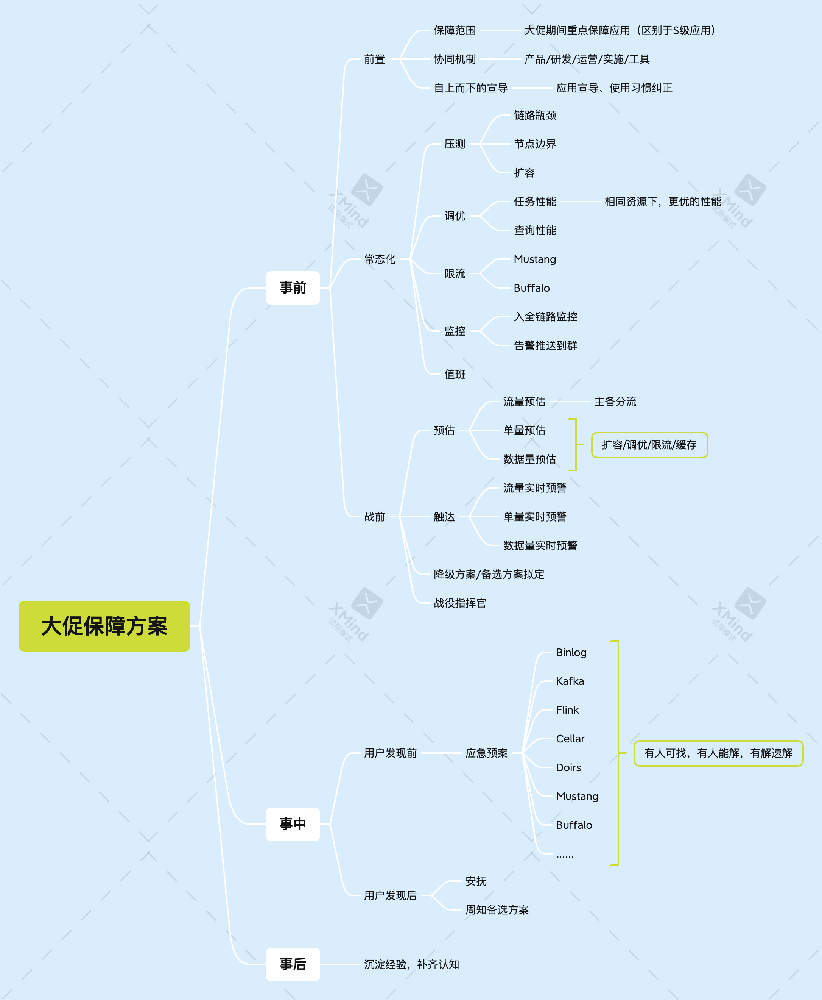

#### 当前准备阶段的侧重点
1. 背景
   * 经过这段时间一个多月的准备，发现不能全面出击，细节太多了，应该抓重点
     * 算法与数据结构
       * 分治
       * 递归
       * 枚举
       * 动归
       * 深搜/广搜
       * 时间复杂度、空间复杂度
     * 系统设计
       * 大促方案
         
         * 事前
           * 前置
             * 保障范围
               * 大促期间重点保障应用
             * 协同机制
               * 产品、研发、运营、实施、工具
             * 自上而下的宣导
               * 应用宣导，使用习惯纠正
           * 常态化
             * 压测
               * 链路瓶颈
               * 节点边界
               * 扩容
             * 调优
               * 任务性能-相同资源下更优的性能
               * 查询性能
             * 限流
             * 降级
             * 监控
               * 全链路监控
               * 告警推送到群
             * 值班
           * 战前
             * 预估
               * 流量预估，主备分流
               * 单量预估
               * 数据来量预估
                 * 扩容、调优、限流、缓存
             * 触达
               * 流量实时预警
               * 单量实时预警
               * 数据量实时预警
             * 降级方案、备选方案拟定
             * 战役指挥官
         * 事中
           * 用户发现前
             * 应急预案，有人可找，有人能解，有解速解
           * 用户发现后
             * 安抚
             * 周知备选方案 
         * 事后
           * 事后复盘，沉淀经验，补齐认知
       * 限流
         * 场景
           * 突发流量
           * 恶意流量
           * 业务需要
         * 算法
           * 固定时间窗口
             * 相邻窗口首尾，临界问题
             * 尖刺
           * 滑动时间窗口
             * 滑动窗口越小，限流越精确，但是开销也越大
           * 漏斗
             * 流量平整，针对突发流量系统处理能力不做
           * 令牌桶
             * 流量平整，应对突发流量
     * 常用中间件的系统模型
       * rpc
         * http2 特性
           1. 压缩算法，使用二进制传输数据
           2. 引入流的概念，多路复用
           3. 头部压缩，客户端与服务端共同维护了一套索引表，在传输过程中key可以直接使用索引，而不是字符串，减少传输的信息，静态表 固有字段，动态表在请求过程中动态更新
       * mq
       * 简单了解spark
         * rdd,data_set,dataFrame
         * 宽依赖，窄依赖
         * transform，action（触发计算）
       * mysql
         * 索引：B树，B+树
         * 事务
           * ACID
           * 锁：表变更锁(独占，共享)，表锁，行锁、间隙锁（解决幻读）
           * mvcc
       * redis
         * 数据结构
           * String
             * 数组、
           * Hash
             * 压缩表、HashTable
           * List
             * 压缩表，链表
           * Set
             * intset(元素是long)，hash
           * ZSet
             * 压缩表，SkipList
         * 备份方式
           * AOP
             * 将redis写日志追加到日志文件
           * RDB
             * 定时制作快照
     * 项目
       * 选品
       * 平时主要关注的指标
         * 异常数量
         * qps: 价格5k,15台4核8G
         * tp99
         * 慢sql/慢服务
     * Java基础
       * jvm内存模型(JMM)
         * Java语言中用于描述多线程并发访问共享内存时的一种规范。它定义了线程与内存之间的交互方式和规则，保证了多线程在共享内存时的可见性、原子性和有序性
         * JMM规定了六种内存间的操作
           * unlock：用于释放一个被锁定的变量，从而使其他线程可以访问该变量
           * lock：用于将一个变量标识为一条线程独占的。当一个线程获取锁时，如果锁已经被占用，那么线程就会等待锁释放
           * read：从主存中读取一个变量的值
           * load：从主存中加载一个变量的值到当前线程工作内存中
           * store：将一个变量的值从当前线程的工作内存中写回到主存中
           * write：将一个变量的值写入到当前线程的工作内存中
         * 三大特性
           * 原子性
           * 可见性
           * 有序性
         * 内存屏障
           * 指令重排
         * 主存与工作内存
       * 锁（重点学习aqs）
         * 状态state，维护锁状态,cas变更
         * 独占锁（exclusive）/共享锁(shared)
         * LockSupport.park()/LockSupport.unpark()
         * CLH 队列，waitStatus 标识队列节点的不同状态，上一个节点释放锁后，激活下一个节点的线程，自旋（spin）获取锁
         * Condition:类似Sychronized，主要方法：await，notify，notifyAll
           - ```java
                Lock lock = new ReLock
                lock.lock()
                Condition con = lock.condition
            ```
         * sychronized
           - monitor
           - 锁膨胀：偏向锁，轻量级锁，重量级锁
           - 对象头标识锁状态
         * synchronized 与 ReentranceLock 对 interrupt 的响应
           * 在等待获取锁的过程中
             * syn 不会被打断
               * 获取锁后，调用sleep，wait 等方法时或调用过程中，会响应 interrupt，抛出 InterruptException
             * RL 如果使用方法 doAcquireInterruptibly  则会抛出 InterruptException
         * 使用RL 的地方
           * 使用锁超时、公平锁、可中断、尝试获取锁
       * 容器
         * HashMap
           * 初始化 最近的2的幂次方
           * 扩容，两倍扩容
         * ConcurrentHashMap
           * 加锁，表头
           * 扩容 ForwardingNode,helperTransform
       * gc
         * jvm 内存分布
           * 线程相关
             * 方法栈
             * 本地方法栈
             * 计数器
           * 堆
           * MetaSpace
             * 方法区
             * 常量
         * G1（Garbage First）
           * 设置目标回收时间，大部分gc时间控制在目标回收时间内，通过调整分配的region，回收收益大的region，垃圾多的
           * 堆分成region，大小 2M-32M，大对象区域
           * minor gc,mix gc
           * 分代-Eden，old
           * RSet，CSet
           * 3色标记
           * 标记复制、标记整理